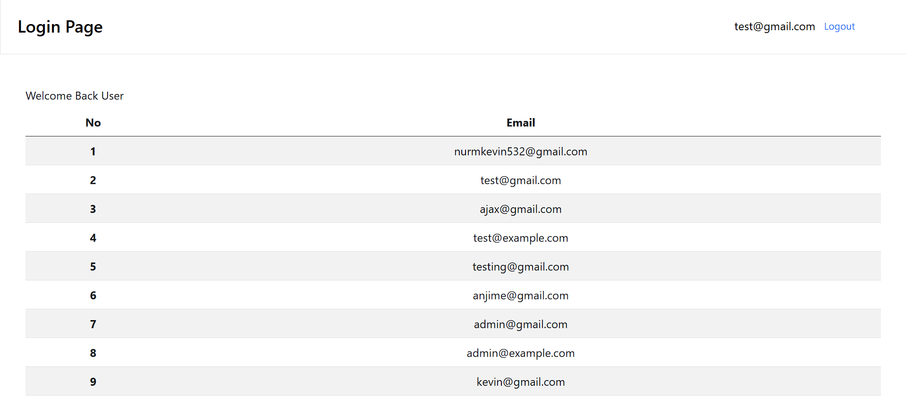
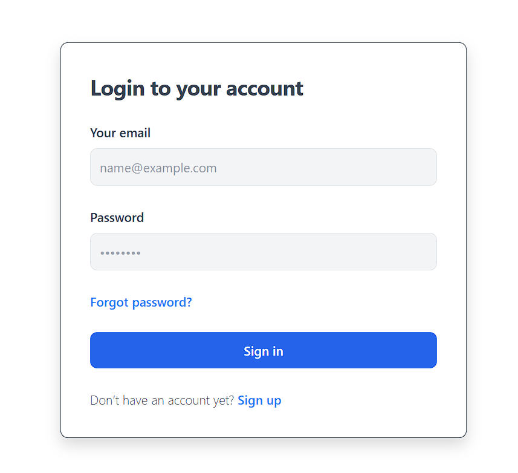
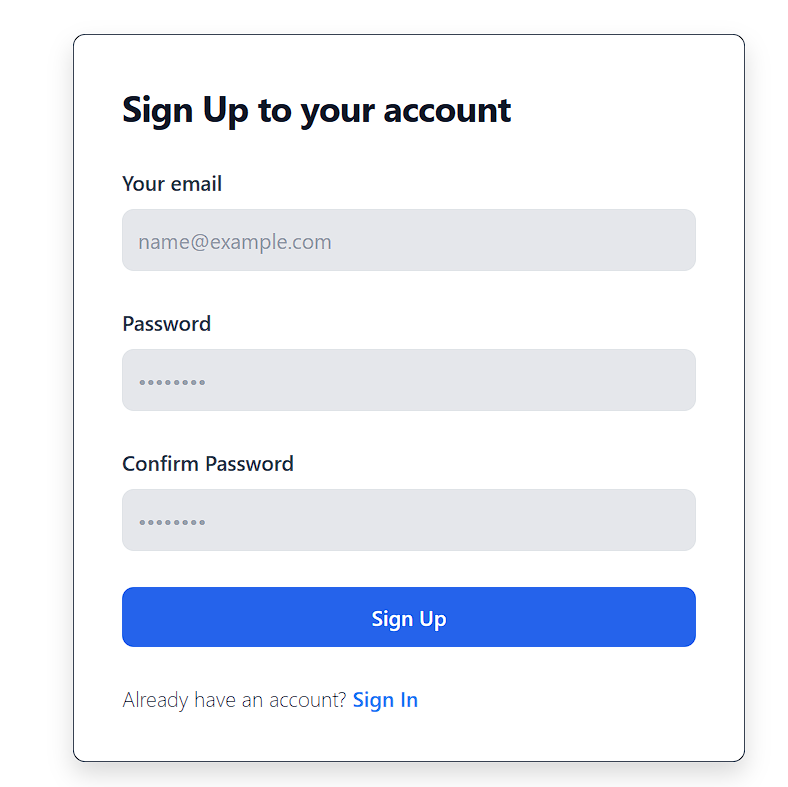
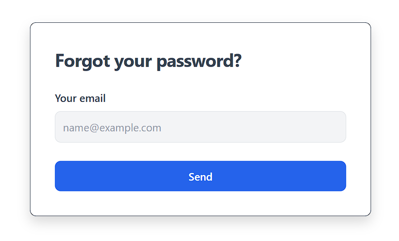

# Halaman Login Otentikasi (MERN Stack)

Proyek otentikasi login dengan JWT dengan fitur seperti login, register, lupa password.

## 🖼️ **Demo**

### Tampilan Dashboard  


### Tampilan Login  


### Tampilan Register  


### Tampilan Forgot Pass  


---

## Fitur

- **Sign Up** - Membuat akun pengguna baru.
- **Login** - Pengguna login menggunakan otentikasi JWT.
- **Forgot Password** - Mengambil kembali akun dengan mereset kata sandi.
- **Melihat Pengguna yang Telah Login** - Menampilkan pengguna yang berhasil login.

## Teknologi

Proyek saya menggunakan beberapa proyek open-source untuk bekerja dengan baik:

- **[MongoDB](https://www.mongodb.com/)** - Database NoSQL untuk menyimpan data pengguna.
- **[Express](https://expressjs.com/)** - Kerangka aplikasi web Node.js yang cepat dan minimal untuk backend.
- **[React](https://reactjs.org/)** - Library UI/UX untuk membangun antarmuka pengguna frontend.
- **[Node.js](https://nodejs.org/)** - I/O berbasis acara untuk membangun server backend.
- **[JWT (JSON Web Token)](https://jwt.io/)** - Digunakan untuk otentikasi pengguna yang aman dan manajemen token.


## Pengembangan

Untuk memulai lingkungan pengembangan, ikuti langkah-langkah berikut:
1. Pastikan .env di setup terlebih dahulu

### Backend
```sh
cd /backend
npm run dev
```

Second Tab:
### Frontend
```sh
cd /frontend
npm start
```

## License

@Oracle4me

**Semua paket yang digunakan adalah open-source, saya hanya membangun aplikasi menggunakan stack MERN**
